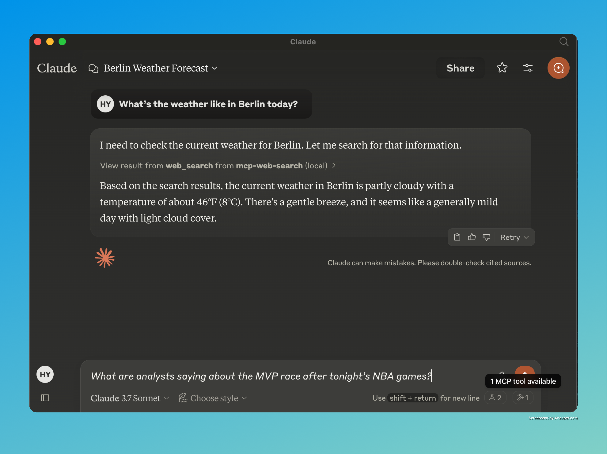

# MCP Web Search Tool

A powerful Model Context Protocol (MCP) server providing real-time web search capabilities through pluggable search providers. Currently integrated with the [Brave Search API](https://api-dashboard.search.brave.com/app/documentation/web-search/get-started).



## ✨ Features

- **Real-Time Information Access**: Enables AI assistants to retrieve up-to-date information from the web
- **Pluggable Search Providers**: Modular architecture allows for easy switching between different search engines
- **Structured Output Format**: Returns search results in a clean, consistent JSON format
- **Smart Query Handling**: Automatically categorizes queries and provides AI assistants with context-aware guidance

## 📋 Requirements

- **Node.js**: v16.x or newer
- **npm**: v7.x or newer
- **Brave Search API Key**: Required for accessing the Brave Search API

## 🚀 Installation

1. **Clone the Repository**:
   ```bash
   git clone https://github.com/gabrimatic/mcp-web-search-tool.git
   cd mcp-web-search-tool
   ```

2. **Install Dependencies**:
   ```bash
   npm install
   ```

3. **Configure Environment Variables**:
   Create a `.env` file in the project root:
   ```
   BRAVE_API_KEY=your_api_key_here
   MAX_RESULTS=10 # Optional: Default is 10
   REQUEST_TIMEOUT=10000 # Optional: Default is 10000ms
   ```

4. **Build the Project**:
   ```bash
   npm run build
   ```

## 💻 Usage

### Starting the Server
```bash
npm start
```

### Testing the Server
```bash
node test-server.js
```

## Integration with Claude Desktop App _(optional)_

One of the most exciting aspects of this project is its seamless integration with the Claude Desktop app. This integration allows users to ask Claude questions that require real-time information, and Claude will automatically use the web search tool to provide up-to-date answers.

### Configuration

1. Create a `claude_desktop_config.json` file:
   ```json
   {
     "mcpServers": {
       "mcp-web-search": {
         "command": "node",
         "args": [
           "/path/to/your/mcp-web-search-tool/build/index.js"
         ]
       }
     }
   }
   ```

2. Launch Claude Desktop with your configuration file.

3. Ask Claude questions requiring real-time information, and it will automatically use the web search tool.

###  🎥 YouTube Video

Watch Claude in action using the MCP Web Search Tool for real-time AI browsing!

[📺 Claude + MCP Web Search – Live Demo](https://youtu.be/6jAnjJSCL30?si=4n0-NtTyG_3SVaFh)

## Example Queries:
- "What are analysts saying about the MVP race after tonight’s NBA games?"
- "What are the latest news about artificial intelligence?"
- "What's the weather like in New York today?"
- "How is the stock market performing right now?"

## 🛠️ Available Tools

#### Web Search
- **Tool Name**: `web_search`
- **Description**: Search the web for REAL-TIME information
- **Necessarily For**: Weather, current events, sports scores, stock market updates
- **Parameters**:
  - `search_term` (string): The search term to look up
  - `provider` (string, optional): Search provider (defaults to Brave)

### Query Categories
The tool automatically categorizes queries into:
- Weather information
- Current events and news
- Sports scores and results
- Stock market and financial data
- Time-sensitive information
- General information seeking

## 📜 License

[MIT License](LICENSE)

## 👨‍💻 Developer
By [Hossein Yousefpour](https://gabrimatic.info "Hossein Yousefpour")

&copy; All rights reserved.

## 📝 Medium Article

Read more about the MCP Web Search Tool, its capabilities, and how it enhances AI-driven web search in our detailed Medium article:
📖 [Deep Dive into MCP Web Search Tool](https://medium.com/@gabrimatic/introducing-mcp-web-search-tool-bridging-ai-assistants-to-real-time-web-information-5df9ab92ad02)


## ☕ Support
<a href="https://www.buymeacoffee.com/gabrimatic" target="_blank"></a>
