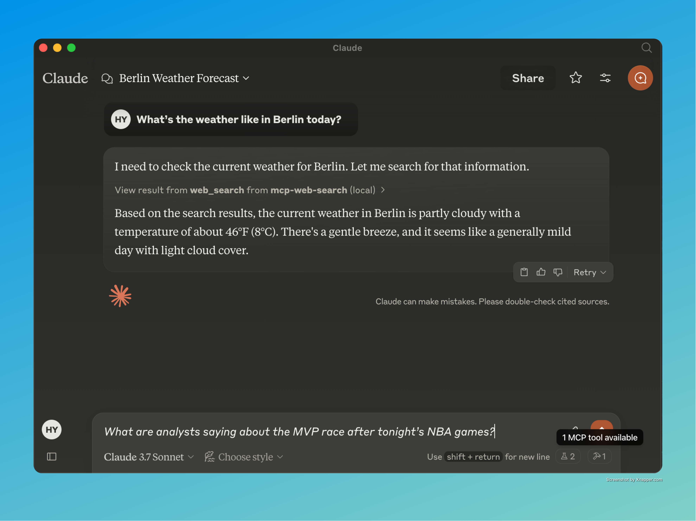

# MCP Web Search Tool

An [MCP](https://modelcontextprotocol.io) server that lets your assistant search the live web, read full pages, and cite sources. Stdio transport, pluggable providers, no scrapers in your dependency tree.



[](https://github.com/gabrimatic/mcp-web-search-tool/actions/workflows/ci.yml)
[](LICENSE)
[](https://nodejs.org)

[Quick start](#quick-start) · [Tools](#tools) · [Configuration](#configuration) · [Clients](./MCP_CLIENTS.md) · [Security](./SECURITY.md) · [Changelog](./CHANGELOG.md)

---

## TL;DR

You get five tools: `web_search`, `news_search`, `image_search`, `fetch_url`, `list_providers`. Search returns ranked summaries with stable ids; `fetch_url` reads the page behind any id. Brave Search is the primary provider; DuckDuckGo runs without a key as a fallback.

## Requirements

| | |
|---|---|
| **Node.js** | `>= 18.17` (uses native `fetch`) |
| **npm** | `>= 9` |
| **Brave Search API key** | optional. Without it, DuckDuckGo handles `web_search`. `news_search` and `image_search` need a key. |

## Quick start

```bash
git clone https://github.com/gabrimatic/mcp-web-search-tool.git
cd mcp-web-search-tool
npm install
cp .env.example .env   # edit BRAVE_API_KEY if you have one
npm run build
npm start
```

Run with Docker instead:

```bash
docker build -t mcp-web-search .
docker run --rm -i -e BRAVE_API_KEY mcp-web-search
```

Wire it into Claude Desktop, Claude Code, Codex, VS Code, Cursor, or Windsurf: see [`MCP_CLIENTS.md`](./MCP_CLIENTS.md).

---

## Tools

Every tool returns two content blocks: a Markdown rendering for the model and a fenced JSON block with the structured payload. Errors come back as `isError: true` content with an actionable message; only unknown-tool calls throw a protocol error.

### `web_search`

Live web search. Use first for current, source-backed answers.

| Parameter | Type | Description |
|---|---|---|
| `search_term` | string, **required** | Query string. |
| `provider` | enum | `"brave search"` or `"duckduckgo"`. Defaults to Brave when a key is set, otherwise DuckDuckGo. |
| `count` | int (1–20) | Number of results. Default 10. |
| `offset` | int | Pagination offset (web only). |
| `cursor` | string | Opaque cursor from a previous response. |
| `freshness` | string | `pd` (24h), `pw` (week), `pm` (month), `py` (year), or `YYYY-MM-DDtoYYYY-MM-DD`. |
| `country` | string | ISO country code. |
| `search_lang` | string | UI language, e.g. `en`. |
| `safesearch` | enum | `off`, `moderate`, `strict`. |
| `include_domains` | string[] | Restrict results to these hosts. |
| `exclude_domains` | string[] | Drop results from these hosts (hostname-suffix match). |

### `news_search`

Recent news with source name and publish date. Brave only.

### `image_search`

Image results with thumbnails. Brave only.

### `fetch_url`

Reads a search result or arbitrary `http(s)` URL. Pass a result id from a previous search (preferred) or a full URL.

| Parameter | Type | Description |
|---|---|---|
| `id_or_url` | string | A result id (e.g. `r_a1b2c3d4e5f6`) or a full `http(s)` URL. |
| `url` | string | Deprecated alias for `id_or_url`. |
| `max_chars` | int (200–200 000) | Soft cap on returned characters. Default 8000. |
| `cursor` | string | Cursor from a previous response to continue reading. |

Returns the page title, readable text (scripts, styles, nav, footer, and aside stripped), the first 25 outbound links, HTTP status, content-type, byte length, and a `nextCursor` when truncated.

Refuses non-`http(s)` schemes and any host that resolves to a private, loopback, link-local, multicast, or IPv4-mapped IPv6 private address. Details: [`SECURITY.md`](./SECURITY.md).

### `list_providers`

Returns the registered providers and the current default. Call this once if you are unsure whether `news_search` or `image_search` are available in this session.

---

## Configuration

All configuration is environment-driven. Reference: [`.env.example`](./.env.example).

| Variable | Default | Purpose |
|---|---|---|
| `BRAVE_API_KEY` | empty | Brave Search API key. When unset, DuckDuckGo is used. |
| `MAX_RESULTS` | `10` | Default result count (clamped 1–50). |
| `REQUEST_TIMEOUT` | `10000` | Per-request timeout in ms (1 000–60 000). |
| `DEFAULT_PROVIDER` | auto | Force a specific provider (e.g. `duckduckgo`). |
| `ALLOW_KEYLESS` | `true` | When `false`, the server refuses to start without `BRAVE_API_KEY`. |
| `CACHE_MAX_ENTRIES` / `CACHE_TTL_MS` | `256` / `300000` | Search cache. |
| `FETCH_CACHE_MAX` / `FETCH_CACHE_TTL_MS` | `128` / `600000` | URL-fetch cache. |
| `FETCH_TIMEOUT_MS` / `FETCH_MAX_BYTES` | `15000` / `2000000` | Per-request budget for `fetch_url`. |

---

## How it fits together

```
src/
├── index.ts                    MCP server: tool registry, dispatch, rendering
├── config.ts                   env loader, validation, defaults
├── providers/
│   ├── SearchProvider.ts       abstract contract and shared types
│   ├── SearchProviderFactory   registry and default selection
│   ├── BraveSearchProvider     web/news/images via Brave API
│   └── DuckDuckGoProvider      keyless HTML-lite fallback
├── services/
│   ├── SearchService.ts        provider dispatch, LRU+TTL cache
│   └── FetchService.ts         safe URL fetch, readable extraction
└── utils/
    ├── http.ts                 native fetch, retry/backoff/timeout
    ├── html.ts                 zero-dep HTML to text + links
    ├── cache.ts                LRU+TTL cache
    └── ids.ts                  stable result-id minting and resolution
tests/                          vitest suite
```

### Add a provider

```ts
import { SearchProvider, SearchResponse, SearchOptions } from './SearchProvider.js';

export class MyProvider extends SearchProvider {
  getName() { return 'My Provider'; }
  override requiresApiKey() { return true; }
  async search(query: string, _opts: SearchOptions = {}): Promise<SearchResponse> {
    const out = this.emptyResponse(query, 'web');
    out.results = mapped; // shape: SearchResult[]
    return out;
  }
}
```

Register it in `SearchProviderFactory.setupDefaults`. Result ids are minted automatically when you call `mintResultId(url)` on each entry.

---

## Development

```bash
npm run dev          # tsx watch mode
npm test             # vitest (23 tests)
npm run lint
npm run format
npm run build
```

CI runs on Node 18, 20, and 22, plus a Docker image build. Tests cover the LRU+TTL cache, HTML extractor, DuckDuckGo parser, search-service caching, HTTP retry/backoff, SSRF guard, domain match, and the result-id resolver.

---

## Example prompts

- _"What are analysts saying about the MVP race after tonight's NBA games?"_
- _"Summarise the top three results for `RAG benchmarks 2025` and pull the abstract from the first paper."_
- _"Find images of the Webb telescope's latest deep field, then open the NASA page and quote the caption."_
- _"What's the weather in Berlin right now?"_

---

## 📜 License

[MIT License](LICENSE)

## 👨‍💻 Developer

By [Soroush Yousefpour](https://gabrimatic.info "Soroush Yousefpour")

&copy; All rights reserved.

## 🎥 YouTube Video

Watch the MCP Web Search Tool in action with Claude:

📺 [Claude + MCP Web Search – Live Demo](https://youtu.be/6jAnjJSCL30?si=4n0-NtTyG_3SVaFh)

## 📝 Medium Article

Read more about the MCP Web Search Tool, its capabilities, and how it enhances AI-driven web search:

📖 [Deep Dive into MCP Web Search Tool](https://medium.com/@gabrimatic/introducing-mcp-web-search-tool-bridging-ai-assistants-to-real-time-web-information-5df9ab92ad02)

## ☕ Support

<a href="https://www.buymeacoffee.com/gabrimatic" target="_blank"></a>
